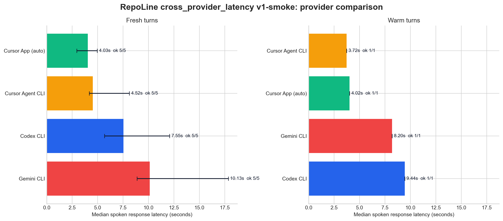

<p align="center">
  
</p>

<p align="center">
  <strong>A voice bridge for CLI coding agents.</strong><br />
  Call Claude Code, Codex, Cursor, Gemini, and other local coding CLIs from your phone or browser.
</p>

<p align="center">
  <a href="https://github.com/williamwarlick/RepoLine/actions/workflows/ci.yml">
    
  </a>
  <a href="./LICENSE">
    
  </a>
  
  
</p>

RepoLine is a voice bridge that connects a LiveKit phone or browser session to a coding CLI running in a local repo.
The CLI session stays local to your machine, keeps its existing auth and tool access, and speaks results back over voice.
Model inference still happens wherever your chosen coding CLI normally sends it.

## Quick Start

Prerequisites:

- `claude`, `codex`, `cursor-agent`, or `gemini` for the coding CLI you want to bridge
- `bun`

```bash
bun run setup
bun run doctor
bun run live
```

`bun run setup` installs the local RepoLine configuration and dependencies, but it does not start the worker or frontend. It can install missing local tools, run `lk cloud auth`, add a LiveKit project manually, write the local env files, install dependencies, install the RepoLine voice skill into the target repo, and wire phone access. If the project does not have an active LiveKit number yet, setup can search for a US local number and purchase it from the CLI before it creates the dispatch rule.
For scripted onboarding and smoke tests, setup also accepts `--provider`, `--project`, `--workdir`, `--agent-name`, and `--skip-phone`.
`./scripts/bootstrap.sh` is still available if you want RepoLine to install `bun`, `uv`, `lk`, and a supported coding CLI for you, or if you need to repair one missing tool later.

If you are onboarding from scratch, start with `Codex CLI` unless you already know you want a different provider. The current onboarding guide, setup defaults, and provider recommendations live in [docs/ONBOARDING.md](./docs/ONBOARDING.md).

## Run Modes

- `bun run live`: normal local use, including real calls
- `bun run dev`: hot reload while working on RepoLine itself
- `bun run agent`: start only the LiveKit worker when the frontend is hosted elsewhere

## What RepoLine Does

- connects browser sessions or phone calls to a local coding CLI workdir
- supports `claude`, `codex`, `cursor`, and `gemini`
- supports a version-sensitive `Cursor App` transport with `BRIDGE_CURSOR_TRANSPORT=app`; on the current tested build it is the fastest Cursor-backed runtime path
- speaks streamed output as soon as the provider gives usable text
- supports browser chat input alongside voice
- publishes repo artifacts into the browser transcript when the bridge emits them
- keeps repo access, auth, and tool execution on your machine

## Security

RepoLine is local-first by default.

- new setups default to `BRIDGE_ACCESS_POLICY=readonly`
- the frontend binds to `127.0.0.1` unless you explicitly opt into remote access
- hosted frontends should stay private and use `REPOLINE_ACCESS_PIN`
- the local worker still has to be running for voice sessions and phone calls to reach your repo

See [SECURITY.md](./SECURITY.md) before exposing RepoLine outside your laptop or LAN.

## Docs

- [Onboarding and defaults](./docs/ONBOARDING.md)
- [Docs index](./docs/README.md)
- [How it works](./docs/HOW-IT-WORKS.md)
- [Benchmarking and evals](./docs/EVALS.md)
- [Phone access](./docs/PHONE.md)
- [Latency notes](./docs/LATENCY.md)
- [Costs and limits](./docs/COSTS.md)
- [Security policy](./SECURITY.md)

## Latency Harness

Use the latency harness as a local latency lab for coding-agent response timing. The canonical artifact is one JSONL turn record per run, and each row now carries `benchmark_family`, `benchmark_revision`, a plan SHA-256 fingerprint, transport metadata, submit mode, and fresh-session strategy so reports can reject invalid cross-pack comparisons.

```bash
bun run benchmark:latency benchmarks/latency/cross-provider-latency-v1.json \
  --json-out output/latency/cross-provider-latency-v1.jsonl
bun run benchmark:report output/latency/cross-provider-latency-v1.jsonl \
  --markdown-out output/latency/cross-provider-latency-v1.md
bun run benchmark:analyze output/latency/cross-provider-latency-v1.jsonl \
  --output-dir output/latency
```

### Comparable Smoke Snapshot



Current comparable artifacts:

- unified smoke rows: [`output/latency/cross-provider-latency-v1-smoke.jsonl`](./output/latency/cross-provider-latency-v1-smoke.jsonl)
- local diagnostic summary: [`output/latency/cross-provider-latency-v1-smoke.md`](./output/latency/cross-provider-latency-v1-smoke.md)
- analysis summary: [`output/latency/cross-provider-latency-v1-smoke-analysis.md`](./output/latency/cross-provider-latency-v1-smoke-analysis.md)
- fresh archetype chart: [`output/latency/cross-provider-latency-v1-smoke-fresh-archetypes.png`](./output/latency/cross-provider-latency-v1-smoke-fresh-archetypes.png)
- session delta chart: [`output/latency/cross-provider-latency-v1-smoke-session-deltas.png`](./output/latency/cross-provider-latency-v1-smoke-session-deltas.png)
- provider summary CSV: [`output/latency/cross-provider-latency-v1-smoke-provider-summary.csv`](./output/latency/cross-provider-latency-v1-smoke-provider-summary.csv)
- fresh archetype CSV: [`output/latency/cross-provider-latency-v1-smoke-fresh-archetypes.csv`](./output/latency/cross-provider-latency-v1-smoke-fresh-archetypes.csv)
- failure reasons CSV: [`output/latency/cross-provider-latency-v1-smoke-failure-reasons.csv`](./output/latency/cross-provider-latency-v1-smoke-failure-reasons.csv)
- session delta CSV: [`output/latency/cross-provider-latency-v1-smoke-session-deltas.csv`](./output/latency/cross-provider-latency-v1-smoke-session-deltas.csv)

The core planning harness measures:

- `provider_first_status_ms`
- `provider_first_assistant_delta_ms`
- `spoken_response_latency_ms`
- `completed_turn_ms`
- `fresh` versus `warm` session state
- `prompt_variant` and `latency_archetype` as first-class dimensions
- provider transport, submit mode, and fresh-session strategy
- `benchmark_family` and `benchmark_revision` as hard comparability keys

The canonical cross-provider comparison pack is:

- `codex`
- `cursor` app transport
- `cursor` CLI transport
- `gemini` CLI transport

For a faster checked-in artifact that still uses the same unified comparison shape, use the smoke companion pack:

```bash
bun run benchmark:latency benchmarks/latency/cross-provider-latency-v1-smoke.json \
  --json-out output/latency/cross-provider-latency-v1-smoke.jsonl
bun run benchmark:report output/latency/cross-provider-latency-v1-smoke.jsonl \
  --markdown-out output/latency/cross-provider-latency-v1-smoke.md
bun run benchmark:analyze output/latency/cross-provider-latency-v1-smoke.jsonl \
  --output-dir output/latency
```

The report and analysis flow keeps `fresh` and `warm` separate on purpose, and the chart layer rejects mixed benchmark families or revisions by default.
`benchmark:analyze` also emits a warm-vs-fresh session-delta chart plus tidy CSV exports with `median`, `p90`, `IQR`, bootstrap median confidence intervals, and grouped failure reasons so the data can be reused in notebooks or slides without scraping Markdown tables.

There is also a dedicated prompt-variant pack for Codex:

```bash
bun run benchmark:latency benchmarks/latency/prompt-variants-codex.json \
  --json-out output/latency/prompt-variants-codex.jsonl
bun run benchmark:report output/latency/prompt-variants-codex.jsonl \
  --markdown-out output/latency/prompt-variants-codex.md
```

For Cursor specifically, there are still two different runtime paths:

- `BRIDGE_CURSOR_TRANSPORT=cli`: headless `cursor-agent`
- `BRIDGE_CURSOR_TRANSPORT=app`: submit into the open Cursor app and read replies from the app's local composer state

The app transport is the current low-latency recommendation for Cursor-backed runtime turns, but it still depends on the current Cursor desktop build and a live local app session. Keep `Codex CLI` as the boring first-run default, and keep `Cursor Agent` CLI as the simpler clean-benchmark fallback.

Cursor runtime model control now works like this:

- `Cursor Agent` CLI sessions can switch between supported models live from the browser control bar
- `Cursor App` sessions now switch between the supported Cursor runtime models from the browser control bar by updating Cursor's local runtime state

## License

MIT. See [LICENSE](./LICENSE).
