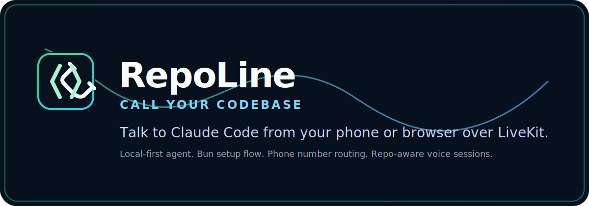
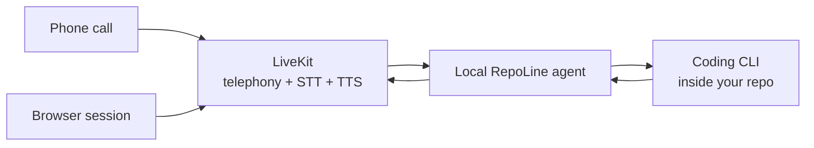

<p align="center">
  
</p>

<p align="center">
  <strong>Call your codebase.</strong><br />
  Talk to your coding CLI from your phone or browser over LiveKit.
</p>

<p align="center">
  <a href="https://github.com/williamwarlick/RepoLine/actions/workflows/ci.yml">
    
  </a>
  <a href="./LICENSE">
    
  </a>
  
  
</p>

<p align="center">
  <a href="#why-repoline">Why RepoLine</a> ·
  <a href="#quick-start">Quick start</a> ·
  <a href="#how-it-works">How it works</a> ·
  <a href="#security-model">Security model</a> ·
  <a href="./docs/ARCHITECTURE.md">Architecture</a> ·
  <a href="./docs/BRANDING.md">Branding</a>
</p>

## Why RepoLine

RepoLine gives you a phone line into a local coding CLI session.

It is built for the case where the code, auth, and tool access all need to stay on your machine, but you still want to talk to your repo naturally from your laptop or your phone.

What it does well:

- routes a LiveKit browser session or phone call into a local coding CLI workdir
- speaks streamed CLI output as soon as the provider emits usable text
- keeps setup short with `bun run setup`, `bun run dev`, and `bun run doctor`
- auto-discovers linked LiveKit projects and existing project phone numbers
- wires a 4-digit caller PIN and number-scoped SIP dispatch rule during setup
- supports `claude` and `codex` today through a shared bridge layer
- ships a `skills.sh`-compatible voice behavior skill for RepoLine sessions

## Quick Start

Prerequisites:

- `claude` or `codex` installed and authenticated
- `lk` installed and already linked to the LiveKit project you want to use
- `uv`
- `bun`

Run:

```bash
bun run setup
bun run dev
bun run doctor
```

The setup wizard:

1. reads the LiveKit projects already linked in your `lk` CLI config
2. lets you choose the target project
3. lets you choose the coding CLI and repo workdir from discovered local git repos
4. installs the project-scoped `repoline-voice-session` skill into that repo for the selected coding CLI
5. writes `agent/.env.local` and `frontend/.env.local`
6. installs agent and frontend dependencies
7. pre-downloads agent runtime files
8. optionally wires inbound telephony from the project's existing LiveKit number

If the selected LiveKit project has exactly one active phone number, setup uses it automatically. If it has multiple, setup asks which one to attach. If it has none, setup tells you and skips phone wiring until the project has a number.

When phone wiring is enabled, setup creates or updates a SIP dispatch rule, asks for a 4-digit caller PIN, and scopes inbound routing to the configured LiveKit project number.

## How It Works



RepoLine itself is not the model.

LiveKit handles media transport, speech-to-text, text-to-speech, and telephony. Your local coding CLI stays the real coding agent. RepoLine forwards final user turns into that CLI and speaks streamed output back as soon as it can.

The bridge intentionally does not store a mirrored chat history. Continuity stays with the underlying CLI through its own session handling.

During slower turns, RepoLine:

- speaks one short bridge-generated acknowledgement immediately after a turn starts
- relies on the coding CLI to narrate what it is doing once the response begins
- merges closely spaced final transcripts before sending them to the CLI
- prompts the CLI to announce tool work and delegate deeper background investigation when useful

## RepoLine Skill

RepoLine publishes a project-installable skill at [`skills/repoline-voice-session`](./skills/repoline-voice-session).

It follows the `skills.sh` / Agent Skills format and defines how the coding agent should behave in spoken RepoLine sessions:

- ear-friendly phrasing instead of screen-heavy formatting
- one short sentence before tool work
- short progress updates during longer tasks
- concise spoken wrap-ups with outcome, blockers, and next step

To install it manually in another repo:

```bash
npx skills add williamwarlick/RepoLine --skill repoline-voice-session -a claude-code -a codex
```

You can also inspect the skill locally:

```bash
npx skills add . --list
```

## From Your Phone

`bun run dev` starts both the Python LiveKit agent and the Bun-run frontend. The frontend binds to `0.0.0.0` so you can open it from your phone on the same network.

Open the frontend from your laptop first. Then open the same app from your phone using your laptop's LAN IP, for example:

```text
http://192.168.1.20:3000
```

If you configured telephony in setup, RepoLine prints the number to call and the caller PIN in the setup summary.

## Security Model

RepoLine is intentionally local-first.

- your coding CLI stays on your machine with access to your local repo
- LiveKit handles voice transport and phone ingress
- the frontend token route is development-only and intentionally throws outside development
- the local worker still has to be running for inbound phone calls to reach the CLI

The development-only token route lives in [`frontend/app/api/token/route.ts`](./frontend/app/api/token/route.ts).

For production-like previews or a deployed frontend, set `NEXT_PUBLIC_APP_URL` so Open Graph and social metadata resolve to the correct host instead of localhost.

## Developer Notes

- Agent code lives in [`agent/`](./agent)
- Frontend lives in [`frontend/`](./frontend)
- Setup and orchestration live in [`scripts/phone-bridge.ts`](./scripts/phone-bridge.ts)
- Streaming debug harness lives in [`scripts/agent_stream_bridge.py`](./scripts/agent_stream_bridge.py)

Useful docs:

- [Architecture](./docs/ARCHITECTURE.md)
- [Phone number plan](./docs/PHONE-NUMBER-PLAN.md)
- [Streaming bridge](./docs/STREAMING-BRIDGE.md)
- [Branding](./docs/BRANDING.md)

## Debugging The Stream

You can inspect the bridge's text stream directly:

```bash
python3 scripts/agent_stream_bridge.py \
  --provider claude \
  --working-directory /path/to/your/repo \
  "Tell me what files are in the current directory."
```

The script emits JSONL events, including sentence-sized `speech_chunk` items.

## Observability

RepoLine emits telemetry in three places:

- local JSONL turn logs at `agent/logs/bridge-telemetry.jsonl`
- worker logs with LiveKit metrics and state transitions
- LiveKit Cloud session recording for traces, logs, and transcripts

Current defaults in `agent/.env.local` are:

- `LIVEKIT_RECORD_TRACES=true`
- `LIVEKIT_RECORD_LOGS=true`
- `LIVEKIT_RECORD_TRANSCRIPT=true`
- `LIVEKIT_RECORD_AUDIO=true`
- `BRIDGE_PROMETHEUS_PORT=9465`

When the agent is running locally, Prometheus metrics are exposed at:

```text
http://127.0.0.1:9465/metrics
```

## Known Limits

- Claude Code still has the best partial-text path today. RepoLine can speak sentence chunks as soon as Claude emits stream deltas.
- Codex CLI support currently uses `codex exec --json` / `codex exec resume --json`. In this repo's local testing, that surface exposes lifecycle events and final `agent_message` text, but not token deltas on stdout, so Codex speech starts after the final message arrives.
- The backend still launches the coding CLI per user turn. Continuity stays with the provider session ID or thread ID, not through local transcript replay.
- The browser path is the most polished entry point today.
- Internet-facing deployment still needs a real auth layer for the frontend token route.

## License

MIT. See [LICENSE](./LICENSE).
