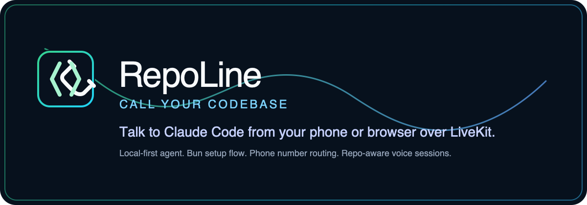

<p align="center">
  
</p>

<p align="center">
  <strong>Call your codebase.</strong><br />
  Talk to your local coding CLI from your phone or browser over LiveKit.
</p>

<p align="center">
  <a href="https://github.com/williamwarlick/RepoLine/actions/workflows/ci.yml">
    
  </a>
  <a href="./LICENSE">
    
  </a>
  
  
</p>

RepoLine bridges a LiveKit phone or browser session to a coding CLI running in a local repo.
The CLI session stays local to your machine, keeps its existing auth and tool access, and speaks results back over voice.
Model inference still happens wherever your chosen coding CLI normally sends it.

## Quick Start

Prerequisites:

- `claude`, `codex`, or `cursor-agent` for the coding CLI you want to bridge
- `bun`, `uv`, and `lk`

Fresh machine?

```bash
./scripts/bootstrap.sh
```

The bootstrap script can install `bun`, `uv`, `lk`, and one supported coding CLI for you.

Run:

```bash
./scripts/bootstrap.sh
bun run setup
bun run doctor
bun run live
```

`bun run setup` can install missing local tools, run `lk cloud auth`, add a LiveKit project manually, write the local env files, install dependencies, install the RepoLine voice skill into the target repo, and wire phone access. If the project does not have an active LiveKit number yet, setup can search for a US local number and purchase it from the CLI before it creates the dispatch rule.
Use `bun run setup -- --no-start` if you want to configure RepoLine without immediately launching the live worker and frontend.
For scripted onboarding and smoke tests, setup also accepts `--provider`, `--project`, `--workdir`, `--agent-name`, and `--skip-phone`.

## Run Modes

- `bun run live`: normal local use, including real calls
- `bun run dev`: hot reload while working on RepoLine itself
- `bun run agent`: start only the LiveKit worker when the frontend is hosted elsewhere

## What RepoLine Does

- connects browser sessions or phone calls to a local coding CLI workdir
- supports `claude`, `codex`, and `cursor`
- speaks streamed output as soon as the provider gives usable text
- supports browser chat input alongside voice
- publishes repo artifacts into the browser transcript when the bridge emits them
- keeps repo access, auth, and tool execution on your machine

## Security

RepoLine is local-first by default.

- new setups default to `BRIDGE_ACCESS_POLICY=readonly`
- the frontend binds to `127.0.0.1` unless you explicitly opt into remote access
- hosted frontends should stay private and use `REPOLINE_ACCESS_PIN`
- the local worker still has to be running for voice sessions and phone calls to reach your repo

See [SECURITY.md](./SECURITY.md) before exposing RepoLine outside your laptop or LAN.

## Docs

- [Docs index](./docs/README.md)
- [How it works](./docs/HOW-IT-WORKS.md)
- [Phone access](./docs/PHONE.md)
- [Costs and limits](./docs/COSTS.md)
- [Security policy](./SECURITY.md)

## License

MIT. See [LICENSE](./LICENSE).
