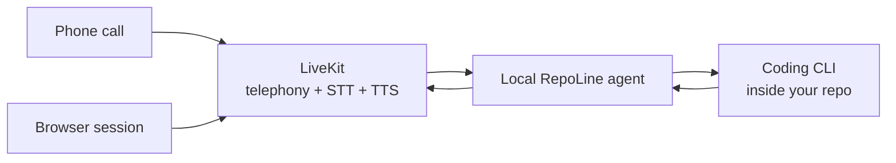

<p align="center">
  <strong>Call your codebase.</strong><br />
  Talk to your coding CLI from your phone or browser over LiveKit.
</p>

<p align="center">
  <a href="https://github.com/williamwarlick/RepoLine/actions/workflows/ci.yml">
    
  </a>
  <a href="./LICENSE">
    
  </a>
  
  
</p>

<p align="center">
  <a href="#why-repoline">Why RepoLine</a> ·
  <a href="#quick-start">Quick start</a> ·
  <a href="#how-it-works">How it works</a> ·
  <a href="#security-model">Security model</a> ·
  <a href="./docs/README.md">Docs</a> ·
  <a href="./docs/PHONE.md">Phone access</a> ·
  <a href="./docs/COSTS.md">Costs and limits</a>
</p>

## Why RepoLine

RepoLine gives you a phone line into a local coding CLI session.

It is built for the case where the code, auth, and tool access all need to stay on your machine, but you still want to talk to your repo naturally from your laptop or your phone.

What it does well:

- routes a LiveKit browser session or phone call into a local coding CLI workdir
- speaks streamed CLI output as soon as the provider emits usable text
- keeps setup short with `bun run setup`, `bun run live`, `bun run agent`, `bun run dev`, and `bun run doctor`
- auto-discovers linked LiveKit projects and existing project phone numbers
- wires a 4-digit caller PIN and number-scoped SIP dispatch rule during setup
- supports `claude`, `codex`, and `cursor` through a shared provider adapter layer
- ships a `skills.sh`-compatible voice behavior skill for RepoLine sessions

## Quick Start

Prerequisites:

- `claude`, `codex`, or `cursor-agent` installed and authenticated
- `lk` installed and already linked to the LiveKit project you want to use
- `uv`
- `bun`

Run:

```bash
bun run setup
bun run live
bun run doctor
```

Use `bun run live` for real calls while other agents may be editing the repo. It runs the voice agent without the LiveKit dev watcher, which avoids mid-call job reloads.

Use `bun run agent` when the browser UI is hosted somewhere else, such as a protected Vercel preview deployment. It starts only the LiveKit agent and skips the local Next.js server.

Use `bun run dev` only when you explicitly want hot reload behavior while iterating on the bridge itself.

The setup wizard:

1. reads the LiveKit projects already linked in your `lk` CLI config
2. lets you choose the target project
3. lets you choose the coding CLI and repo workdir from discovered local git repos
4. installs the project-scoped RepoLine voice instructions into that repo for the selected coding CLI
5. writes `agent/.env.local` and `frontend/.env.local`
6. installs agent and frontend dependencies
7. pre-downloads agent runtime files
8. optionally wires inbound telephony from the project's existing LiveKit number

If the selected coding CLI is installed but not authenticated yet, setup now stops and offers to launch that CLI's login flow before continuing.

After setup finishes, RepoLine now starts in `live` mode by default instead of watcher-backed `dev` mode.

If the selected LiveKit project has exactly one active phone number, setup uses it automatically. If it has multiple, setup asks which one to attach. If it has none, setup tells you and skips phone wiring until the project has a number.

When phone wiring is enabled, setup creates or updates a SIP dispatch rule, asks for a 4-digit caller PIN, and scopes inbound routing to the configured LiveKit project number.

## How It Works



RepoLine itself is not the model.

LiveKit handles media transport, speech-to-text, text-to-speech, and telephony. Your local coding CLI stays the real coding agent. RepoLine forwards final user turns into that CLI and speaks streamed output back as soon as it can.

The bridge intentionally does not store a mirrored chat history. Continuity stays with the underlying CLI through its own session handling.

During slower turns, RepoLine:

- speaks one short bridge-generated acknowledgement immediately after a turn starts
- relies on the coding CLI to narrate what it is doing once the response begins
- merges closely spaced final transcripts before sending them to the CLI
- prompts the CLI to announce tool work and delegate deeper background investigation when useful

## RepoLine Skills

RepoLine publishes a project-installable skill at [`skills/repoline-voice-session`](./skills/repoline-voice-session).

It follows the `skills.sh` / Agent Skills format for Claude Code and Codex, and RepoLine also ships a Cursor rule file for `cursor-agent`.

These instructions define how the coding agent should behave in spoken RepoLine sessions:

- ear-friendly phrasing instead of screen-heavy formatting
- one short sentence before tool work
- short progress updates during longer tasks
- concise spoken wrap-ups with outcome, blockers, and next step

Setup also generates a mutable local pronunciation companion skill at
[`skills/repoline-tts-pronunciation`](./skills/repoline-tts-pronunciation).
That copy lives in the target repo, stays scoped to the configured TTS provider,
and is where the agent should record fixes like saying `README.md` as "read me"
instead of spelling it out letter by letter.

To install it manually in another repo:

```bash
npx skills add williamwarlick/RepoLine --skill repoline-voice-session -a claude-code -a codex
```

For Cursor, copy [`skills/repoline-voice-session/cursor-rule.mdc`](./skills/repoline-voice-session/cursor-rule.mdc) into `.cursor/rules/repoline-voice-session.mdc` in the target repo, or let `bun run setup` install it.

You can also inspect the skill locally:

```bash
npx skills add . --list
```

## From Your Phone

`bun run live` starts the Python LiveKit agent in non-watch mode and the Bun-run frontend. The frontend binds to `127.0.0.1` by default so the browser path stays local unless you explicitly opt into LAN exposure.

`bun run dev` starts the same stack, but keeps the LiveKit agent in watch mode and may reload active calls if files change.

If you explicitly want browser access from another device on your LAN, opt in for that run:

```bash
REPOLINE_FRONTEND_HOST=0.0.0.0 REPOLINE_ALLOW_REMOTE_BROWSER=1 bun run live
```

Then open the app from your phone using your laptop's LAN IP, for example `http://192.168.1.20:3000`.

If you configured telephony in setup, RepoLine prints the number to call and the caller PIN in the setup summary.

## Hosted Frontend On Vercel

Phase 1 supports a frontend-only Vercel deployment.

- deploy `frontend/` as its own Vercel project
- enable Vercel deployment protection if your account supports it
- set `LIVEKIT_URL`, `LIVEKIT_API_KEY`, `LIVEKIT_API_SECRET`, `AGENT_NAME`, `NEXT_PUBLIC_APP_URL`, and `REPOLINE_ACCESS_PIN`
- run `bun run agent` anywhere that can still reach your repo, CLI, and LiveKit project

This keeps the current local-first execution model intact. Vercel only hosts the browser entry point; the LiveKit worker still needs to run elsewhere with the same LiveKit credentials and agent name.

## Security Model

RepoLine is intentionally local-first.

- your coding CLI stays on your machine with access to your local repo
- LiveKit handles voice transport and phone ingress
- the bridge now defaults new setups to `BRIDGE_ACCESS_POLICY=readonly`
- use `workspace-write` for sandboxed project edits, or `owner` only on a machine you fully control
- runtime blocks `BRIDGE_ACCESS_POLICY=owner` unless you explicitly set `REPOLINE_ALLOW_OWNER=1`
- runtime keeps the browser frontend on `127.0.0.1` unless you explicitly opt into `REPOLINE_FRONTEND_HOST=0.0.0.0` with `REPOLINE_ALLOW_REMOTE_BROWSER=1`
- the hosted frontend now supports an app-level PIN gate for both the page and `/api/token`
- Vercel Authentication is still useful as an outer layer when it is available on the project
- the local worker still has to be running for inbound phone calls to reach the CLI

The production-safe token route lives in [`frontend/app/api/token/route.ts`](./frontend/app/api/token/route.ts).

For production-like previews or a deployed frontend, set `NEXT_PUBLIC_APP_URL` so Open Graph and social metadata resolve to the correct host instead of localhost.

## Developer Notes

- Agent code lives in [`agent/`](./agent)
- Frontend lives in [`frontend/`](./frontend)
- Setup and orchestration live in [`scripts/phone-bridge.ts`](./scripts/phone-bridge.ts)
- Streaming debug harness lives in [`scripts/agent_stream_bridge.py`](./scripts/agent_stream_bridge.py)

Useful docs:

- [Documentation index](./docs/README.md)
- [How it works](./docs/HOW-IT-WORKS.md)
- [Phone access](./docs/PHONE.md)
- [Costs and limits](./docs/COSTS.md)

## Debugging The Stream

You can inspect the bridge's text stream directly:

```bash
python3 scripts/agent_stream_bridge.py \
  --provider claude \
  --working-directory /path/to/your/repo \
  "Tell me what files are in the current directory."
```

The script emits JSONL events, including sentence-sized `speech_chunk` items.

## Observability

RepoLine emits telemetry in three places:

- local JSONL turn logs at `agent/logs/bridge-telemetry.jsonl`
- worker logs with LiveKit metrics and state transitions
- LiveKit Cloud session recording for traces, logs, and transcripts

Safe recording defaults are:

- `LIVEKIT_RECORD_TRACES=false`
- `LIVEKIT_RECORD_LOGS=false`
- `LIVEKIT_RECORD_TRANSCRIPT=false`
- `LIVEKIT_RECORD_AUDIO=false`

Prometheus metrics are opt-in through `BRIDGE_PROMETHEUS_PORT`. When that port is set, metrics are exposed at:

```text
http://127.0.0.1:9465/metrics
```

## Known Limits

- Claude Code still has the best partial-text path today. RepoLine can speak sentence chunks as soon as Claude emits stream deltas.
- Codex CLI support currently uses `codex exec --json` / `codex exec resume --json`. In this repo's local testing, that surface exposes lifecycle events and final `agent_message` text, but not token deltas on stdout, so Codex speech starts after the final message arrives.
- Cursor Agent support uses `cursor-agent -p --output-format stream-json`. It can stream full assistant messages and final results, but in local docs this is still coarser than Claude's token-delta path.
- The backend still launches the coding CLI per user turn. Continuity stays with the provider session ID or thread ID, not through local transcript replay.
- The browser path is the most polished entry point today.
- A hosted frontend still requires a running LiveKit agent elsewhere in phase 1.

## License

MIT. See [LICENSE](./LICENSE).
