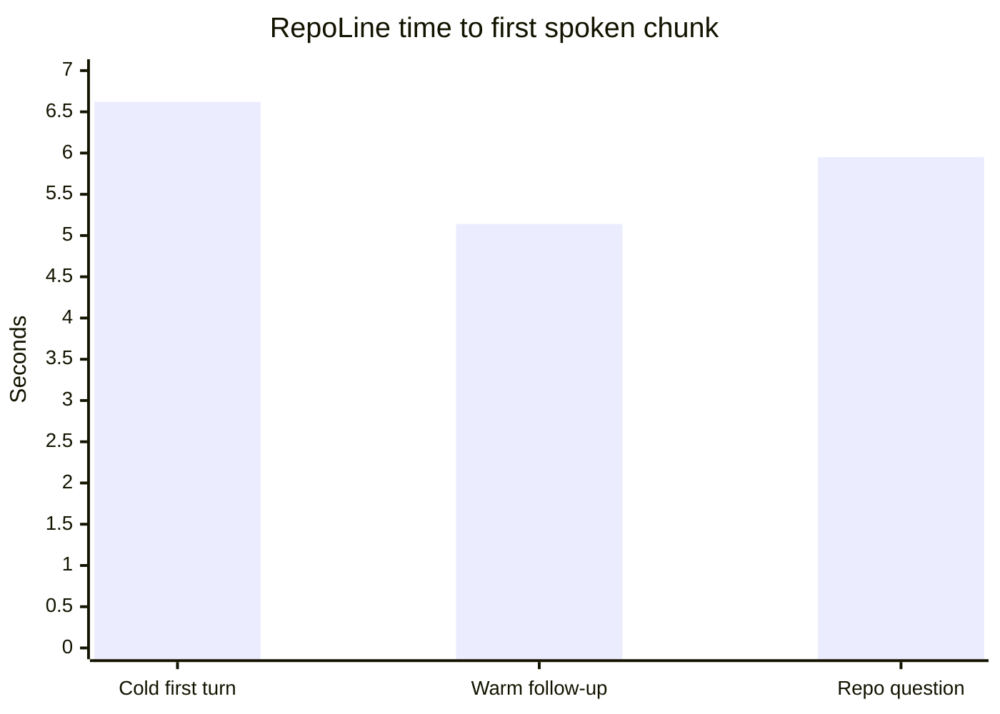

<p align="center">
  
</p>

<p align="center">
  <strong>A voice bridge for CLI coding agents.</strong><br />
  Call Claude Code, Codex, Cursor, Gemini, and other local coding CLIs from your phone or browser.
</p>

<p align="center">
  <a href="https://github.com/williamwarlick/RepoLine/actions/workflows/ci.yml">
    
  </a>
  <a href="./LICENSE">
    
  </a>
  
  
</p>

RepoLine is a voice bridge that connects a LiveKit phone or browser session to a coding CLI running in a local repo.
The CLI session stays local to your machine, keeps its existing auth and tool access, and speaks results back over voice.
Model inference still happens wherever your chosen coding CLI normally sends it.

## Quick Start

Prerequisites:

- `claude`, `codex`, `cursor-agent`, or `gemini` for the coding CLI you want to bridge
- `bun`

```bash
bun run setup
bun run doctor
bun run live
```

`bun run setup` installs the local RepoLine configuration and dependencies, but it does not start the worker or frontend. It can install missing local tools, run `lk cloud auth`, add a LiveKit project manually, write the local env files, install dependencies, install the RepoLine voice skill into the target repo, and wire phone access. If the project does not have an active LiveKit number yet, setup can search for a US local number and purchase it from the CLI before it creates the dispatch rule.
For scripted onboarding and smoke tests, setup also accepts `--provider`, `--project`, `--workdir`, `--agent-name`, and `--skip-phone`.
`./scripts/bootstrap.sh` is still available if you want RepoLine to install `bun`, `uv`, `lk`, and a supported coding CLI for you, or if you need to repair one missing tool later.

If you are onboarding from scratch, start with `Codex CLI` unless you already know you want a different provider. The current onboarding guide, setup defaults, and provider recommendations live in [docs/ONBOARDING.md](./docs/ONBOARDING.md).

## Run Modes

- `bun run live`: normal local use, including real calls
- `bun run dev`: hot reload while working on RepoLine itself
- `bun run agent`: start only the LiveKit worker when the frontend is hosted elsewhere

## What RepoLine Does

- connects browser sessions or phone calls to a local coding CLI workdir
- supports `claude`, `codex`, `cursor`, and `gemini`
- supports an experimental, version-sensitive `Cursor App` transport with `BRIDGE_CURSOR_TRANSPORT=app` for faster app-backed Cursor turns
- supports a direct `Gemini API` transport for fast voice conversations when `GEMINI_API_KEY` or `GOOGLE_API_KEY` is available
- speaks streamed output as soon as the provider gives usable text
- supports browser chat input alongside voice
- publishes repo artifacts into the browser transcript when the bridge emits them
- keeps repo access, auth, and tool execution on your machine

## Security

RepoLine is local-first by default.

- new setups default to `BRIDGE_ACCESS_POLICY=readonly`
- the frontend binds to `127.0.0.1` unless you explicitly opt into remote access
- hosted frontends should stay private and use `REPOLINE_ACCESS_PIN`
- the local worker still has to be running for voice sessions and phone calls to reach your repo

See [SECURITY.md](./SECURITY.md) before exposing RepoLine outside your laptop or LAN.

## Docs

- [Onboarding and defaults](./docs/ONBOARDING.md)
- [Docs index](./docs/README.md)
- [How it works](./docs/HOW-IT-WORKS.md)
- [Benchmarking and evals](./docs/EVALS.md)
- [Phone access](./docs/PHONE.md)
- [Latency notes](./docs/LATENCY.md)
- [Costs and limits](./docs/COSTS.md)
- [Security policy](./SECURITY.md)

## Latency Snapshot

Local RepoLine benchmark on `2026-04-17` using the RepoLine `provider_stream` path with `codex`, read-only access, low reasoning effort, and short one-sentence prompts.
Treat this as a local snapshot rather than a guarantee because provider choice, repo size, auth state, and warm-session reuse all move the numbers around.



| Scenario | Time to first spoken chunk | Time to completed turn |
| --- | ---: | ---: |
| Cold first turn (`Say hi...`, 3 fresh runs avg) | `6.62s` | `6.91s` |
| Warm follow-up (`turn-2` and `turn-3` in the same session avg) | `5.14s` | `5.47s` |
| One-sentence repo answer (`What does RepoLine do?`, 2 fresh runs avg) | `5.95s` | `6.18s` |

On this machine, short RepoLine voice turns with Codex started speaking in about five to seven seconds, and warm follow-up turns were about `1.5s` faster than a cold first reply.

## Latency Harness

Use the latency harness to compare RepoLine's bridge path against raw `cursor-agent` command shapes with the same prompt and config.

```bash
bun run benchmark:latency benchmarks/latency/cursor-realtime.json
```

The sample plan in [`benchmarks/latency/cursor-realtime.json`](./benchmarks/latency/cursor-realtime.json) compares:

- the full RepoLine provider-stream path
- the exact command RepoLine would build for Cursor
- the same Cursor config without the RepoLine voice prompt
- a bare direct `cursor-agent` command

For Cursor specifically, there are now two different paths:

- `BRIDGE_CURSOR_TRANSPORT=cli`: headless `cursor-agent`
- `BRIDGE_CURSOR_TRANSPORT=app`: submit into the open Cursor app and read replies from the app's local composer state

The app transport is the closest local path to the fast in-app experience, but it depends on a live Cursor desktop session for the target workspace.
To compare the new direct app submit path against active-input automation and headless CLI, run:

```bash
bun run benchmark:latency benchmarks/latency/cursor-app-submit-modes.json
```

You can also save machine-readable results:

```bash
uv run --project agent python ./scripts/latency_harness.py \
  benchmarks/latency/cursor-realtime.json \
  --json-out output/latency/cursor-realtime.json
```

For the same Codex conversation snapshot shown above:

```bash
bun run benchmark:latency benchmarks/latency/codex-conversation.json
```

To compare models with a repeatable scorecard and Markdown charts:

```bash
bun run benchmark:latency benchmarks/latency/model-matrix-core.json \
  --json-out output/latency/model-matrix-core.json
python3 ./scripts/latency_report.py output/latency/model-matrix-core.json \
  --markdown-out output/latency/model-matrix-core.md
```

For the current Cursor-versus-Gemini Flash comparison:

```bash
bun run benchmark:latency benchmarks/latency/gemini-vs-cursor.json
```

To isolate raw provider command latency versus the full speech path:

```bash
bun run benchmark:latency benchmarks/latency/provider-command-vs-stream.json
```

## License

MIT. See [LICENSE](./LICENSE).
