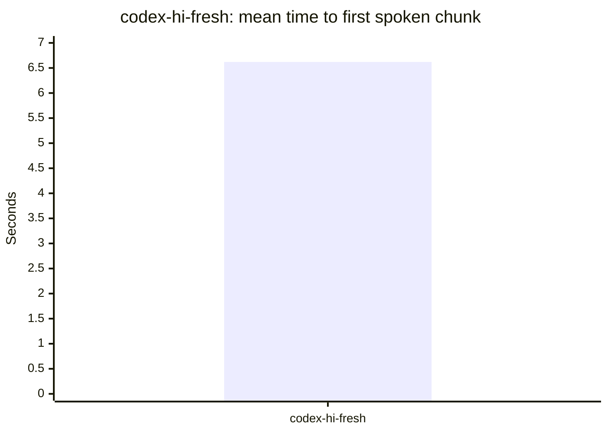
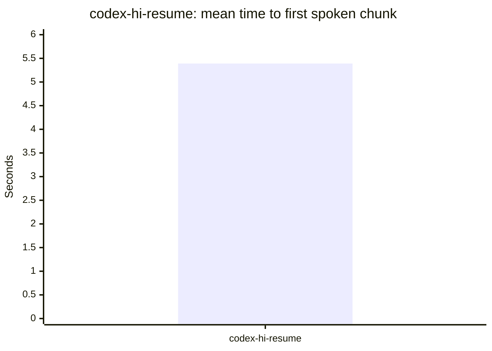
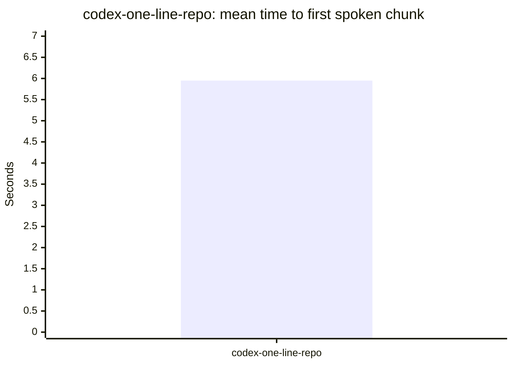

# RepoLine Benchmark Report

Source: `/Users/wwarlick/development/agent-phone-bridge/output/latency/2026-04-17-codex-conversation.json`
Generated: `2026-04-19 16:36 UTC`

## Scorecard

| Task | Variant | Success | Eval pass | Mean first chunk | p50 | p90 | Mean done | n | Notes |
| --- | --- | ---: | ---: | ---: | ---: | ---: | ---: | ---: | --- |
| codex-hi-fresh | codex-hi-fresh | 100.0% | - | 6.62s | 6.89s | 8.16s | 6.91s | 3 | - |
| codex-hi-resume | codex-hi-resume | 100.0% | - | 5.39s | 5.37s | 5.80s | 5.73s | 3 | - |
| codex-one-line-repo | codex-one-line-repo | 100.0% | - | 5.95s | 5.95s | 6.08s | 6.18s | 2 | - |

## codex-hi-fresh

## codex-hi-resume

## codex-one-line-repo

## Guidance

- Compare success rate and eval pass rate before comparing latency. A faster model that misses the task is not actually better.
- Keep cold-start and warm-follow-up benchmarks in separate suites; mixing them hides resume-session wins.
- Use exact-match or string-match tasks for objective checks, and short summary tasks for voice UX checks.
