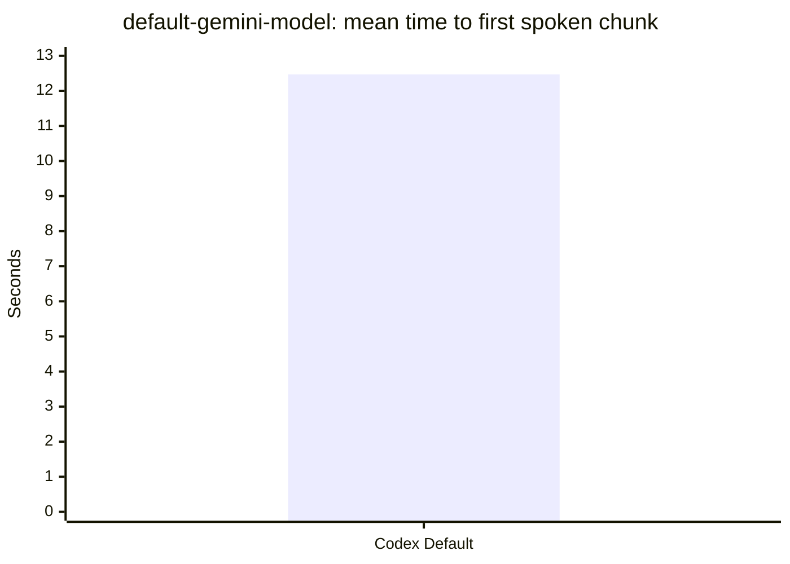

# RepoLine Benchmark Report

Source: `/Users/wwarlick/development/agent-phone-bridge/output/latency/2026-04-17-smoke.json`
Generated: `2026-04-19 16:36 UTC`

## Scorecard

| Task | Variant | Success | Eval pass | Mean first chunk | p50 | p90 | Mean done | n | Notes |
| --- | --- | ---: | ---: | ---: | ---: | ---: | ---: | ---: | --- |
| default-gemini-model | Codex Default | 100.0% | 0.0% | 12.47s | 12.47s | 12.47s | 13.82s | 1 | - |

## default-gemini-model

## Guidance

- Compare success rate and eval pass rate before comparing latency. A faster model that misses the task is not actually better.
- Keep cold-start and warm-follow-up benchmarks in separate suites; mixing them hides resume-session wins.
- Use exact-match or string-match tasks for objective checks, and short summary tasks for voice UX checks.
